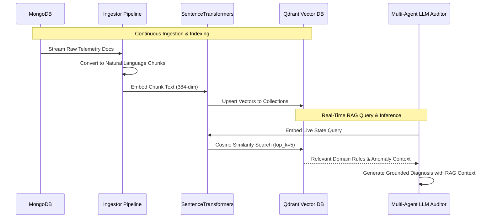

# IoT Electrical Building Digital Twin

A real-time cyber-physical Digital Twin, Retrieval-Augmented Generation (RAG) Diagnostic Engine, and Autonomous Energy Intelligence Platform engineered for campus and commercial power distribution infrastructure.

The platform connects electrical panels and sub-circuits via MQTT telemetry to an interactive 3D spatial twin, high-resolution time-series data stores, dense vector memory, and a grounded Multi-Agent AI Energy Auditor capable of autonomous load shedding and capacity restoration.

---

## Architecture Overview

```mermaid
flowchart TD
    subgraph Messaging Layer
        MQTT["Eclipse Mosquitto MQTT Broker<br/>Topics: building/telemetry, building/control/*"]
    end

    subgraph Data & Storage Layer
        MONGO[("MongoDB<br/>Time-Series Ingestion & Storage")]
        QDRANT[("Qdrant Vector DB<br/>Cosine Similarity Index")]
    end

    subgraph RAG & Intelligence Layer
        INGEST["Continuous Ingestor & Document Chunker"]
        EMBED["SentenceTransformers (all-MiniLM-L6-v2)<br/>Normalized 384-dim Task Vectors"]
        AGENT["Multi-Agent LLM Auditor<br/>(Generator, Auditor, Resolver)"]
    end

    subgraph Backend Service
        API["FastAPI REST & Telemetry Engine"]
    end

    subgraph Frontend Application
        DASH["Next.js Web Application"]
        T1["3D Digital Twin (Three.js / R3F)"]
        T2["Live Dynamic Load Curve"]
        T3["AI Energy Intelligence & Control Matrix"]
    end

    MQTT -->|Telemetry Stream (5s QoS 1)| API
    API -->|Actuation Commands| MQTT

    API -->|Live Ingest| MONGO
    MONGO -->|Unindexed Telemetry| INGEST
    INGEST -->|Text Chunks| EMBED
    EMBED -->|Vector Embeddings| QDRANT

    API -->|Semantic Query| QDRANT
    QDRANT -->|Augmented Context & Rules| AGENT
    AGENT -->|Grounded Decisions| API
    API -->|REST Endpoints / SSE| DASH

    DASH --> T1
    DASH --> T2
    DASH --> T3
```

---

## Key Capabilities

### 1. Spatial 3D Digital Twin Viewport
- Built with React Three Fiber and Three.js for real-time visualization of facility electrical zones:
  - Ground Floor: Administrative & Classroom Circuits
  - First Floor: Heavy Machinery & Laboratory Circuits
  - Second Floor: Computing & Research Studio Circuits
- Interactive raycasting allows operators to select physical zones, view live voltage, current, and active draw, and actuate circuit supply.

### 2. Live Telemetry & Power Quality Analytics
- High-frequency tracking of key electrical parameters:
  - Active Power (P) and Apparent Power (S)
  - Reactive Power (Q) and Power Factor (PF)
  - True RMS Line Voltage (V) and Total Current (I)
  - Cumulative Energy Consumption (kWh)
- Microgrid Solar PV tracking with real-time generation balance and grid offset metrics.

### 3. Dynamic Load Profile Streaming
- Continuous 5-second polling with rolling time labels (`HH:MM:SS`) tracking demand variations, transient startup spikes, and baseline deviations.
- Instant visual alerting when total demand approaches substation breaker limits and peak capacity thresholds.

### 4. Retrieval-Augmented Generation (RAG) Diagnostics
- Dense vector search over Qdrant collections providing grounded contextual knowledge to the AI diagnostic engine:
  - Regulatory standards, substation capacity ceilings, and power factor efficiency thresholds.
  - Commercial time-of-day tariff schedules (Peak and Off-Peak windows).
  - Historical anomaly patterns (inductive phase lag, inrush current transients, cloud shading events).

### 5. Multi-Agent AI Energy Auditor
- Implementation of the multi-agent fact-checking pattern (Generator, Auditor, Resolver) inspired by Google ADK:
  - **Generator Agent**: Synthesizes initial diagnostic assessments from live telemetry augmented with RAG retrieved domain rules.
  - **Auditor Agent**: Deconstructs diagnostic claims into discrete assertions (active load, power factor, reactive losses, zone states) and rigorously verifies them against live ground truth telemetry.
  - **Resolver Agent**: Corrects hallucinations, computes a mathematical Grounding Score ($0.00\text{ to }1.00$), and outputs grounded recommendations.
- **Autonomous Bidirectional Control**:
  - **Overload Load Shedding (`LOAD_SHED`)**: Automatically trips high-draw laboratory circuits upon detecting sustained overload conditions to prevent upstream substation breaker trips.
  - **Autonomous Capacity Restoration (`LOAD_RESTORE`)**: Automatically re-energizes standby circuits once facility demand normalizes and safe capacity headroom is restored.

---

## Retrieval-Augmented Generation (RAG) Architecture

The RAG pipeline grounds diagnostic generation in technical documentation, safety codes, and historical operating data.



### 1. Vector Embeddings
- Model: `sentence-transformers/all-MiniLM-L6-v2` running locally on CPU.
- Output Dimension: 384-dimensional dense vectors with L2 normalization for cosine similarity search.
- Task-Aware Prefixes: Applies `query:` and `passage:` formatting to maximize retrieval precision between live operational state queries and stored reference chunks.

### 2. Qdrant Collections
- `knowledge_base`: Technical safety thresholds, power factor regulations, circuit capacities, and commercial tariff schedules.
- `anomaly_episodes`: Historical transient faults, inrush current surges, and inductive load imbalances.
- `load_readings`: Sliding-window operational snapshots indexing active load, reactive power, and phase metrics over time.

---

## MQTT Messaging Protocol

The messaging layer communicates over standard MQTT topics with QoS 1 reliability.

- **Telemetry Topic**: `building/telemetry`
- **Control Topics**:
  - Ground Floor: `building/control/load1` (`ON` / `OFF`)
  - First Floor Lab: `building/control/load2` (`ON` / `OFF`)
  - Second Floor: `building/control/load3` (`ON` / `OFF`)
- **Status Topic**: `building/status`

### Telemetry Payload Schema
```json
{
  "timestamp": "<ISO-8601 UTC timestamp>",
  "time_label": "<HH:MM:SS local time label>",
  "voltage": "<rms_voltage_float>",
  "current": "<total_current_float>",
  "kW": "<active_power_float>",
  "kVA": "<apparent_power_float>",
  "kVAR": "<reactive_power_float>",
  "powerFactor": "<power_factor_float>",
  "kWh": "<energy_consumption_float>",
  "frequency": "<grid_frequency_float>",
  "solar_kW": "<solar_generation_float>",
  "rooms": {
    "groundFloorRoom": true,
    "firstFloorLab": true,
    "secondFloorRoom": true
  }
}
```

---

## Storage & Database Layer

### 1. MongoDB (`digital_twin_db`)
- **Collection `load_data`**: High-throughput time-series store indexing raw electrical frames, phase data, and consumption history.
- **Collection `solar_data`**: Photovoltaic generation profiles and grid feed-in statistics.

### 2. Qdrant Vector Database
- High-performance vector database indexing dense representations of electrical telemetry and regulatory domain knowledge.
- In-memory caching ensures sub-millisecond retrieval latencies during real-time 5-second polling loops.

---

## Project Structure

```
DigitalTwin-main/
├── mqtt_backend/
│   ├── api.py               # FastAPI application with REST & agent dispatch routes
│   ├── auditor_agent.py     # Multi-Agent LLM Auditor (Generator, Auditor, Resolver)
│   ├── embedder.py          # Local SentenceTransformers embedding provider
│   ├── forecasting.py       # Autoregressive demand prediction engine
│   ├── ingestor.py          # Continuous MQTT/MongoDB -> Qdrant indexing pipeline
│   ├── llm_config.py        # LLM integration (Ollama / Gemini fallback)
│   ├── requirements.txt     # Python backend dependencies
│   ├── seed_from_json.py    # Database initial seeder script
│   ├── simulator.py         # Hardware telemetry simulator & state machine
│   └── vector_store.py      # Qdrant client & vector operations
│
└── smart-load-dashboard/
    ├── app/
    │   ├── components/
    │   │   ├── AIinsights.tsx    # Multi-Agent UI, Fact-Checking audit, Zone matrix
    │   │   ├── Building3D.tsx    # 3D spatial viewport with raycasting
    │   │   ├── Dashboard.tsx     # Substation meters, power factor, solar synergy
    │   │   ├── LoadCurve.tsx     # Real-time streaming dynamic load profile
    │   │   └── NavbarTabs.tsx    # Tab navigation and status indicators
    │   ├── page.tsx              # Main layout and view router
    │   └── globals.css           # Design tokens and base styling
    ├── next.config.ts            # Next.js configuration and proxy rewrites
    ├── package.json              # Frontend dependencies
    └── tsconfig.json             # TypeScript configuration
```

---

## Setup & Deployment Guide

### Prerequisites
- Docker & Docker Compose (for MongoDB, Qdrant, and Eclipse Mosquitto)
- Node.js (v18.0+) and npm
- Python (v3.10+)
- Ollama (optional, for local LLM inference)

---

### Step 1: Start Container Infrastructure

Launch the required background services using Docker:

```bash
# 1. Start Qdrant Vector Database
docker run -d --name qdrant -p 6333:6333 -p 6334:6334 --restart unless-stopped qdrant/qdrant

# 2. Start MongoDB Time-Series Store
docker run -d --name mongodb -p 27017:27017 --restart unless-stopped mongo:latest

# 3. Start Eclipse Mosquitto MQTT Broker
docker run -d --name mosquitto -p 1883:1883 -p 9001:9001 eclipse-mosquitto:latest
```

---

### Step 2: Configure & Launch Backend Service

```bash
cd mqtt_backend

# 1. Create and activate Python virtual environment
python -m venv venv

# Windows:
.\venv\Scripts\activate

# Linux / macOS:
source venv/bin/activate

# 2. Install dependencies
pip install -r requirements.txt

# 3. Seed initial knowledge base and rules into Qdrant & MongoDB
python seed_from_json.py

# 4. Start the FastAPI server
python -m uvicorn api:app --host 127.0.0.1 --port 8000 --reload
```

- Backend API: `http://127.0.0.1:8000`
- Interactive OpenAPI Documentation: `http://127.0.0.1:8000/docs`

---

### Step 3: Configure & Launch Frontend Application

```bash
cd smart-load-dashboard

# 1. Install frontend dependencies
npm install

# 2. Start the development server
npm run dev
```

- Web Dashboard: `http://localhost:3000`

---

## REST API Reference

| Endpoint | Method | Description |
| :--- | :---: | :--- |
| `/latest` | `GET` | Returns instantaneous electrical telemetry and per-room supply states. |
| `/history?limit=30` | `GET` | Returns rolling historical telemetry points with formatted time labels. |
| `/status` | `GET` | Returns zone circuit status and active equipment mappings for 3D twin. |
| `/forecast` | `GET` | Returns autoregressive predictions and capacity utilization forecast. |
| `/agent/audit` | `GET` | Executes Multi-Agent fact-checking audit and outputs load decisions. |
| `/agent/log` | `POST` | Logs autonomous action execution traces into the audit history. |
| `/agent/traces` | `GET` | Returns chronological list of autonomous actions and manual overrides. |
| `/load1/on`, `/load1/off` | `GET` | Actuates Ground Floor classroom relay circuit. |
| `/load2/on`, `/load2/off` | `GET` | Actuates First Floor machinery lab relay circuit. |
| `/load3/on`, `/load3/off` | `GET` | Actuates Second Floor research studio relay circuit. |

---

## Verification & Operational Workflow

1. **Live 3D Viewport**: Open the **3D Digital Twin** tab to inspect real-time zone states and click on rooms to interact with individual electrical circuits.
2. **Dynamic Load Profile**: Open the **Live Load Curve** tab to monitor continuous current and active power trends with rolling timestamps.
3. **Autonomous Agent Execution**: Open the **AI Energy Intelligence** tab:
   - Verify that the Multi-Agent Auditor verifies active telemetry claims with grounded fact-checking.
   - During heavy laboratory load conditions exceeding rated limits, observe the agent trigger autonomous load shedding on the First Floor Lab.
   - When facility demand stabilizes and safe headroom is restored, observe the agent restore supply automatically.
   - Use the **Building Zone Supply Control Matrix** to manually override and toggle any of the 3 circuits.
